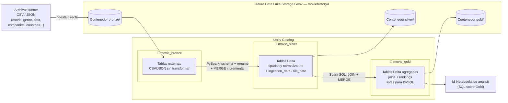

# 🎬 Databricks Movie History

Pipeline de datos end-to-end sobre **Azure Databricks** que implementa una arquitectura **Lakehouse medallion (Bronze → Silver → Gold)** para procesar, transformar y analizar un dataset histórico de películas (títulos, géneros, idiomas, reparto, productoras, países de producción, etc.).

Proyecto desarrollado como parte de un curso práctico de Databricks/Azure, centrado en ingesta incremental, control de calidad y modelado analítico sobre Delta Lake.

---

## 📌 Descripción

El proyecto ingesta un conjunto de archivos (CSV y JSON) con información de películas —datos maestros, reparto, idiomas, géneros, productoras y países— desde **Azure Data Lake Storage Gen2 (ADLS Gen2)**, los limpia y estandariza, y los deja preparados en distintas capas para su explotación analítica mediante SQL.

El pipeline está diseñado para soportar **cargas incrementales por fecha de archivo** (`file_date`), permitiendo reprocesar históricos sin duplicar datos gracias a operaciones `MERGE` sobre Delta Lake.

## 🎯 Objetivo

- Diseñar e implementar una arquitectura **Lakehouse** completa sobre Databricks + ADLS Gen2.
- Practicar los distintos métodos de autenticación y acceso seguro a Azure Data Lake Storage.
- Construir un proceso de **ingesta incremental** robusto (idempotente, parametrizado y reprocesable).
- Modelar datos limpios y relacionados en la capa **Silver**.
- Generar tablas analíticas ya resueltas (joins, agregaciones, rankings) en la capa **Gold**.
- Responder preguntas de negocio concretas sobre presupuesto, ingresos, géneros, países y productoras.

## 🧠 Habilidades demostradas

- **Diseño de arquitectura Lakehouse** (Bronze/Silver/Gold) sobre Delta Lake y Unity Catalog
- **Ingesta incremental / upserts** con `MERGE INTO` (patrón `whenMatchedUpdateAll` / `whenNotMatchedInsertAll`)
- **PySpark**: `DataFrameReader`, `StructType` explícitos, transformaciones column-level
- **Spark SQL**: joins multi-tabla, agregaciones, funciones de ventana (`RANK() OVER (PARTITION BY ... ORDER BY ...)`)
- **Gobernanza de datos** con Unity Catalog (catalog/schema/table, managed vs. external tables)
- **Seguridad y acceso a Azure Data Lake Storage Gen2**: Access Key, SAS Token, Service Principal, External Locations
- **Orquestación de notebooks** parametrizados (`dbutils.widgets`, `dbutils.notebook.run`)
- **Diseño de pipelines idempotentes y reprocesables** (control por `file_date`, reseteo de entornos)

## 📊 Resultados

Las tablas Gold (`movie_gold.results_movie`) permiten responder directamente por SQL preguntas de negocio como:

- Presupuesto e ingresos totales y medios por **país de producción**, en general y acotado a 2010–2015
- Presupuesto e ingresos totales por **productora**, en general y acotado a 2010–2015
- Ranking de presupuesto/ingresos por **año y género**, y por **año y país**, mediante funciones de ventana
- Películas desde el año 2000 con su **género** e **idioma** asociado

> *Pendiente de completar con cifras concretas tras ejecutar los notebooks de `analysis/` sobre el entorno de Databricks (ej. top 5 países por ingresos, evolución del presupuesto medio por década).*

## 🏗️ Arquitectura

Arquitectura **Medallion** (Bronze / Silver / Gold) sobre **Unity Catalog**, con cada capa almacenada en su propio contenedor de ADLS Gen2:



- **Bronze**: tablas externas apuntando directamente a los ficheros CSV/JSON originales en `bronze@moviehistory4`, sin transformar.
- **Silver**: tablas Delta con nombres de columna normalizados, tipado explícito, columnas de auditoría (`ingestion_date`, `environment`, `file_date`) y carga incremental vía `MERGE`.
- **Gold**: tablas Delta con el resultado de joins entre entidades de Silver, listas para consumo directo por SQL/BI (ej. presupuesto e ingresos por país, por productora, por género y año).

**Componentes técnicos:**
- **Cómputo**: Azure Databricks (PySpark + Spark SQL)
- **Almacenamiento**: Azure Data Lake Storage Gen2, un contenedor por capa (`bronze`, `silver`, `gold`)
- **Catálogo/Gobernanza**: Unity Catalog (schemas `movie_bronze`, `movie_silver`, `movie_gold`)
- **Formato de tabla**: Delta Lake (transacciones ACID, `MERGE`, time travel)
- **Orquestación**: `dbutils.notebook.run()` desde un notebook maestro, parametrizado por entorno y fecha de archivo

## 🧬 Metodología

### 1. Set-up y acceso seguro a ADLS Gen2
Antes de construir el pipeline, se evalúan y documentan distintos métodos de autenticación a Azure Data Lake:
- Access Key (no recomendado, acceso de superusuario)
- Token SAS (acceso temporal y granular)
- Service Principal (método recomendado para acceso recurrente/productivo)
- Credenciales a nivel de clúster
- **External Locations** de Unity Catalog como método final elegido, uno por capa (`external_location_bronze_mov_his`, `..._silver_mov_his`, `..._gold_mov_his`)

### 2. Capa Bronze
Creación de tablas **externas** en el schema `movie_bronze` que apuntan directamente a los archivos fuente (CSV y JSON) en el contenedor `bronze`, sin transformar el dato ni duplicarlo.

### 3. Capa Silver — ingesta incremental
Para cada entidad (movie, genre, language, country, person, cast, companies, etc.) un notebook de ingesta:
1. Lee el fichero de origen del día concreto (`p_file_date`) aplicando un `StructType` explícito.
2. Selecciona y renombra columnas al estándar `snake_case` del proyecto.
3. Añade columnas de auditoría: `ingestion_date`, `environment`, `file_date`.
4. Escribe en Delta mediante una función común `merge_delta_lake()`:
   - Si la tabla no existe → `saveAsTable` particionando por `file_date`.
   - Si ya existe → `MERGE` (`whenMatchedUpdateAll` / `whenNotMatchedInsertAll`) usando `movie_id` (o clave equivalente) + `file_date` como condición de match.

Un notebook maestro (`00. Ingestion_all_notebooks`) orquesta la ejecución de todos los notebooks de ingesta para una lista de fechas (`array_file_date`), simulando cargas diarias históricas.

### 4. Capa Gold — modelado analítico
Se combinan las tablas de Silver mediante `JOIN` y se cargan en tablas Gold también vía `MERGE`, resolviendo preguntas de negocio como:
- Presupuesto e ingresos por país y productora
- Películas por género e idioma desde el año 2000
- Ranking de presupuesto/ingresos por año, particionado por año y agrupado por género o país (`RANK() OVER (PARTITION BY ... ORDER BY ...)`)

### 5. Utilidades transversales
- `common_functions`: funciones reutilizables (`add_ingestion_date`, `delete_table_exists`, `merge_delta_lake`) centralizadas en un notebook `%run`-eable.
- `configuration`: rutas base de cada capa (`bronze_folder_path`, `silver_folder_path`, `gold_folder_path`).
- Preparación para carga incremental (`DROP` + recreación de schemas Silver/Gold para pruebas repetibles).
- Notificación por correo ante fallos del pipeline (ej. carpeta de origen no encontrada).

## 📂 Estructura del repositorio

```
databricks-course/movie-history/
├── set-up/            # Métodos de acceso a ADLS Gen2 y configuración de Unity Catalog
├── includes/          # Notebooks reutilizables: configuration y common_functions
├── bronze/            # Creación de tablas externas Bronze (CSV/JSON crudos)
├── ingestion/          # Ingesta incremental Bronze → Silver (uno por entidad) + orquestador
├── transformation/     # Transformaciones y modelado Silver → Gold
├── analysis/           # Notebooks de análisis exploratorio sobre presupuesto/ingresos
└── utils/              # Utilidades: reseteo de entornos, notificación de errores
```

## 🗃️ Modelo de datos (entidades principales)

| Entidad | Capa Bronze | Descripción |
|---|---|---|
| `movies` | CSV | Datos maestros de la película (título, presupuesto, ingresos, fecha, duración, votos...) |
| `genre` | CSV | Catálogo de géneros |
| `languages` | CSV | Catálogo de idiomas |
| `countries` | JSON | Catálogo de países |
| `persons` | JSON | Personas (reparto/equipo) |
| `movies_genres` | JSON | Relación película–género |
| `movies_casts` | JSON | Reparto por película |
| `languages_roles` | JSON | Roles de idioma (original, doblado...) |
| `productions_companies` | CSV (carpeta) | Catálogo de productoras |
| `movies_companies` | CSV (carpeta) | Relación película–productora |
| `movies_languages` | JSON (carpeta) | Relación película–idioma–rol |
| `productions_countries` | JSON (carpeta) | Relación película–país de producción |

## ⚙️ Tecnologías

- **Azure Databricks** (notebooks PySpark + Spark SQL)
- **Azure Data Lake Storage Gen2** (`moviehistory4`)
- **Delta Lake**
- **Unity Catalog**
- **Python / PySpark**

## 🧩 Retos técnicos y decisiones de diseño

- **Managed vs. external tables en Unity Catalog**: en Silver se usan schemas con `MANAGED LOCATION` para que Unity Catalog gestione el ciclo de vida completo (versionado, `OPTIMIZE`/`VACUUM`), en lugar de tablas externas con ruta fija por tabla — se prioriza gobernanza sobre ruta "legible" en el storage.
- **`MERGE` en vez de `overwrite`**: cada entidad se carga con `merge_delta_lake()`, que hace upsert por clave de negocio + `file_date`. Esto permite reprocesar un mismo día sin duplicar filas y sin perder histórico de días anteriores, simulando cargas incrementales reales.
- **Autenticación a ADLS Gen2**: se evaluaron y documentaron cuatro métodos (Access Key, SAS Token, Service Principal, credenciales a nivel de clúster) antes de decidirse por **External Locations** de Unity Catalog, el enfoque recomendado para acceso recurrente y gobernado en producción.
- **Esquemas explícitos (`StructType`) en la ingesta**: se evita `inferSchema` para no depender de una inferencia costosa y potencialmente incorrecta sobre archivos grandes, a costa de mantener el esquema manualmente.
- **Orquestación simple con `dbutils.notebook.run`**: suficiente para el alcance del curso, pero con limitaciones claras de manejo de errores y paralelismo frente a un orquestador real (ver mejoras).

## 🔭 Posibles mejoras

- Sustituir `dbutils.notebook.run()` por **Databricks Workflows** (o Databricks Asset Bundles) para orquestación, reintentos y alertado nativo.
- Añadir **tests** (ej. `pytest` + `chispa`, o Delta Live Tables con expectativas de calidad) para validar esquemas y reglas de negocio antes de promocionar datos a Silver/Gold.
- Externalizar credenciales (actualmente hardcodeadas en `utils/02. mail-error`) a **Databricks Secrets**.
- Automatizar despliegue con **CI/CD** (ej. GitHub Actions + Databricks CLI/Asset Bundles) en lugar de ejecución manual de notebooks.
- Particionar y aplicar `OPTIMIZE`/`Z-ORDER` en las tablas Gold de mayor volumen para mejorar el rendimiento de consulta.

## 🎞️ Origen de los datos

Dataset de películas de estilo TMDB (títulos, presupuesto, ingresos, reparto, géneros, idiomas, productoras y países de producción), distribuido como material de un curso práctico de Databricks/Azure, en formato CSV y JSON, y cargado de forma simulada como llegadas incrementales por fecha (`file_date`).

## 🚀 Cómo ejecutar el pipeline

1. Ejecutar los notebooks de `set-up/` para configurar el acceso a ADLS Gen2 (o dar por hecho que los *External Locations* ya están creados).
2. Ejecutar `bronze/01. create_bronze_tables` para registrar las tablas externas sobre los datos crudos.
3. Ejecutar `ingestion/13. create_silver_database` para crear el schema `movie_silver` con su `MANAGED LOCATION`.
4. Ejecutar `ingestion/00. Ingestion_all_notebooks`, que dispara todos los notebooks de ingesta (`01` a `12`) para cada fecha definida en `array_file_date`.
5. Ejecutar `transformation/05. create_gold_database` y, a continuación, los notebooks de `transformation/` para generar las tablas Gold.
6. Consultar los resultados desde `analysis/` o directamente por SQL sobre `movie_gold.*`.

Para reiniciar el entorno y volver a cargar todo desde cero, usar `utils/01. prepare_for_incremental_load` (elimina y recrea los schemas Silver y Gold).

## 👤 Autor

Eloy — Data Analyst especializado en analítica y prevención del fraude, con experiencia en desarrollo full-stack y analítica de datos.
